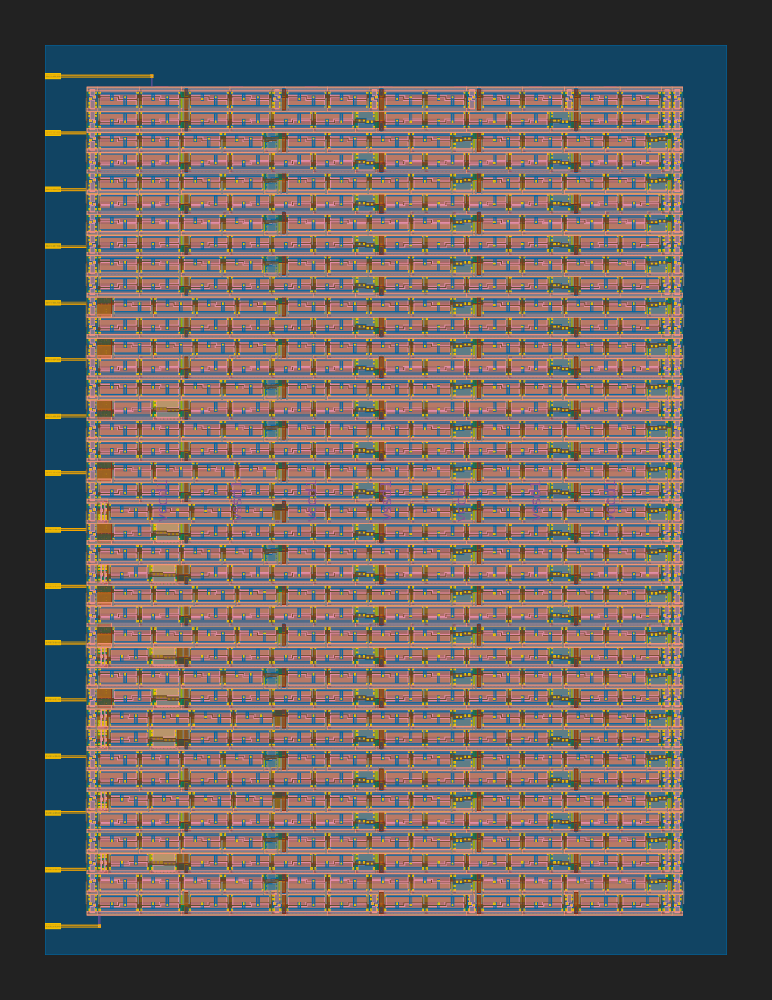

 

# XLS template for TinyTapeout

Template for submitting [TinyTapeout](https://tinytapeout.com) designs based on [XLS: Accelerated HW Synthesis](https://github.com/google/xls) toolkit .

## Pre-requisite

Please see the instructions for:

* [Enabling GitHub Actions](https://tinytapeout.com/faq/#when-i-commit-my-change-the-gds-action-isnt-running)
* [Enabling GitHub Pages](https://tinytapeout.com/faq/#my-github-action-is-failing-on-the-pages-part)

## Usage

1. [Generate](https://github.com/proppy/tinytapeout-xls-test/generate) a new project based on this template

1. [Enable GitHub Actions](https://tinytapeout.com/faq/#when-i-commit-my-change-the-gds-action-isnt-running)

1. [Enable GitHub Pages](https://tinytapeout.com/faq/#my-github-action-is-failing-on-the-pages-part)

1. Modify [src/user_module.x](src/user_module.x) ([DSLX language reference](https://google.github.io/xls/dslx_reference/))

	```
	pub fn user_module(io_in: u8) -> u8 {
	  io_in
	}

	#![test]
	fn user_module_test() {
	  let _= assert_eq(user_module(u8:0b0010_1010), u8:42);
	  _
	}
	```

1. Push and check the (https://github.com/proppy/tinytapeout-xls-test/actions/workflows/wokwi.yaml) action artefacts.

    - `src/user_module.v`: generated verilog
	
		```
		module user_module_USER_MODULE_ID(
		  input wire [7:0] io_in,
		  output wire [7:0] out
		);
		  assign out = io_in;
		endmodule
		```
	
	- `gds_render.svg`: GDS preview
	
        

1. Goto 3 until satisfied

1. Submit the design to  [TinyTapeout](https://tinytapeout.com)

## Resources

* [FAQ](https://tinytapeout.com/faq/)
* [Digital design lessons](https://tinytapeout.com/digital_design/)
* [Join the community](https://discord.gg/rPK2nSjxy8)

## What next?

* Share your GDS on Twitter, tag it [#tinytapeout](https://twitter.com/hashtag/tinytapeout?src=hashtag_click) and [link me](https://twitter.com/matthewvenn)!
